# Data Flow Rules
*Notes App - State Management Architecture*

## 🔄 Data Flow Principles

### Single Source of Truth
All application data flows through centralized Pinia stores. Components never manage their own state for shared data.

### Unidirectional Data Flow
```
User Action → Store Action → State Update → Component Re-render
```

### Store Responsibilities
1. **Fetch data** from APIs or local storage
2. **Transform/normalize** data for consistent usage
3. **Distribute state** to components
4. **Handle side effects** (API calls, persistence, sync)

## 📊 Data Flow Diagrams

### Overall Application Data Flow
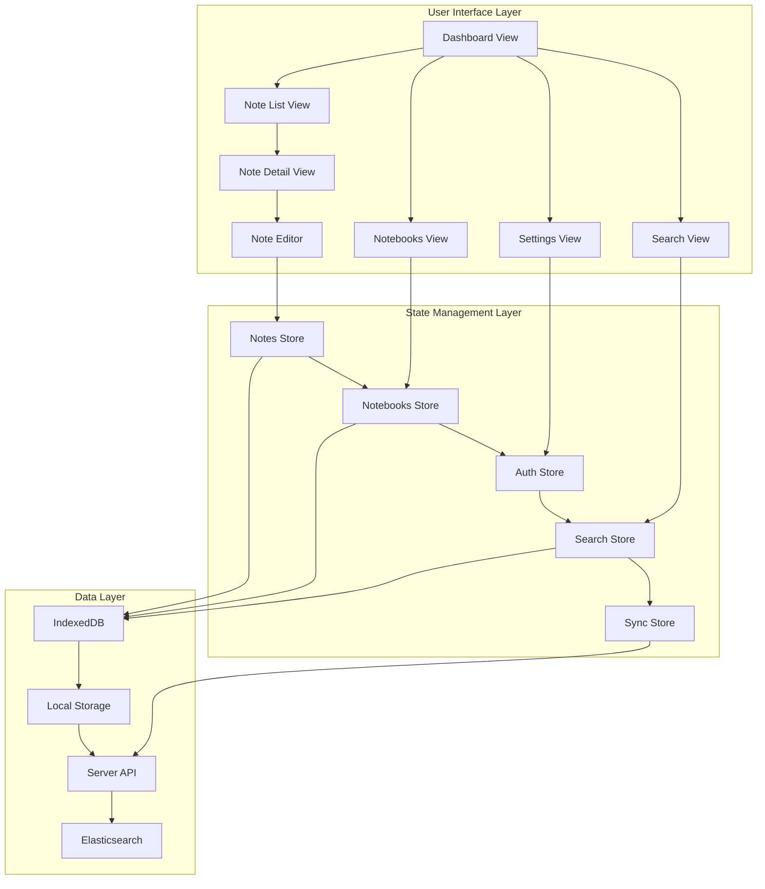

### Note Creation Flow
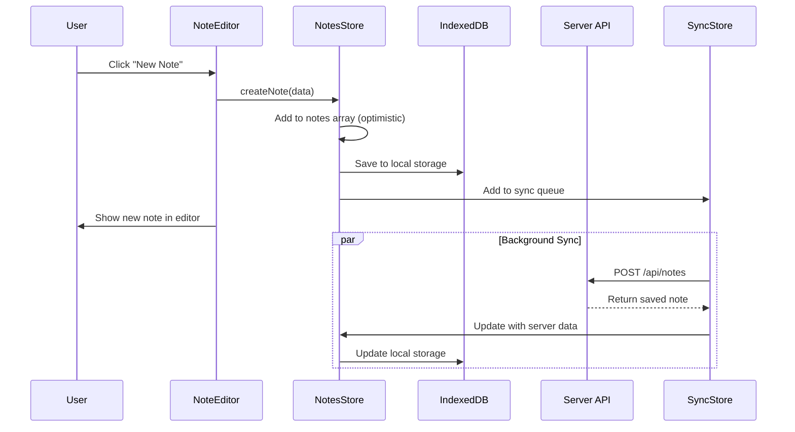

### Note Editing Flow
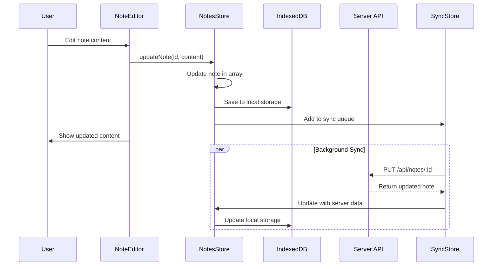

### Search Flow
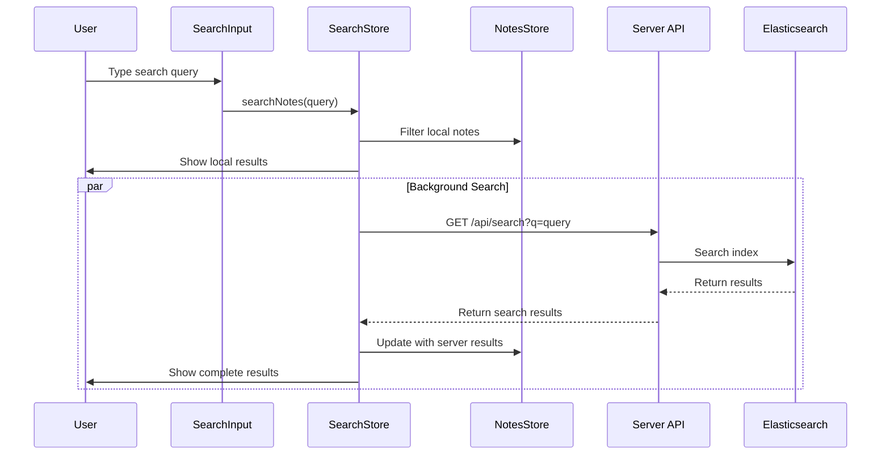

### Notebook Organization Flow
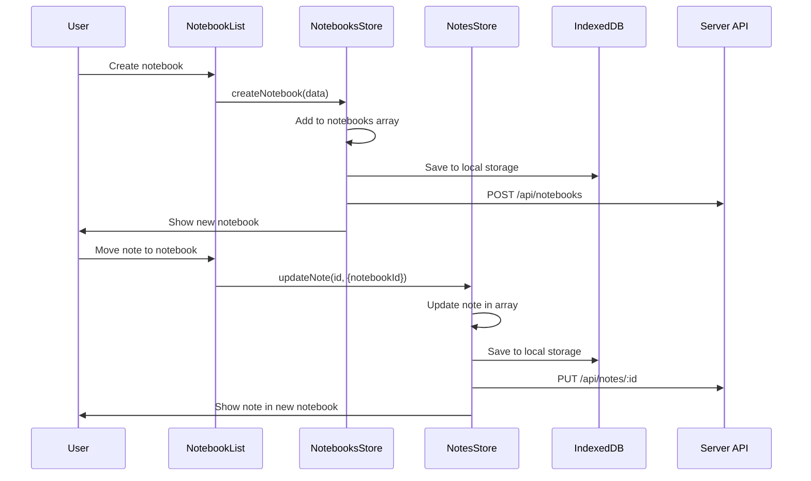

### Authentication Flow
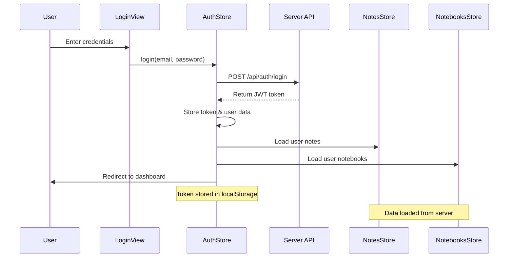

### Offline Sync Flow
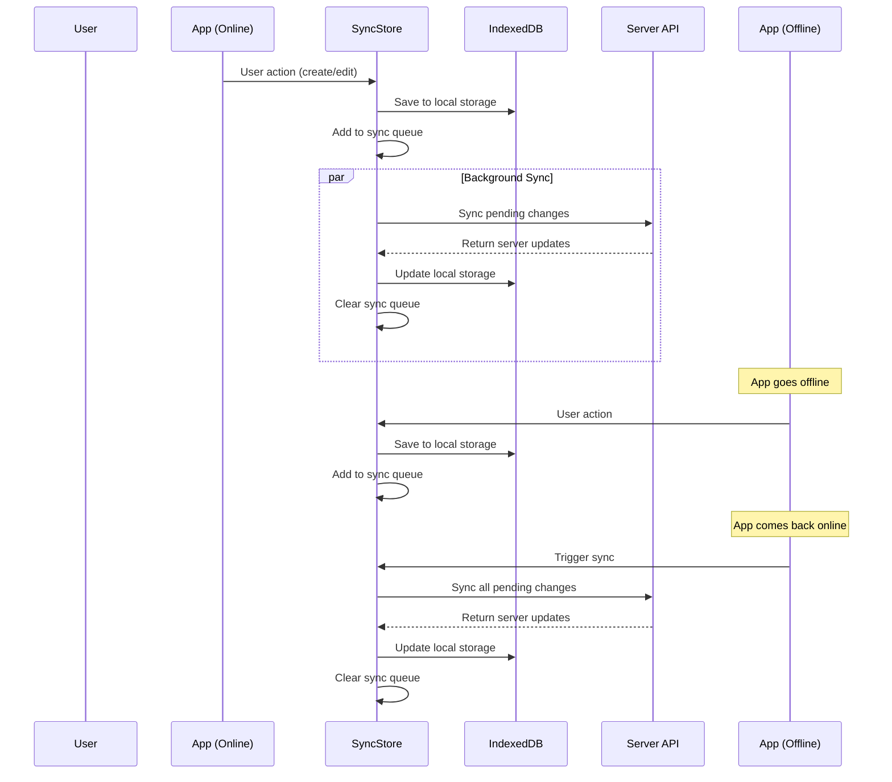

### Rich Media Upload Flow
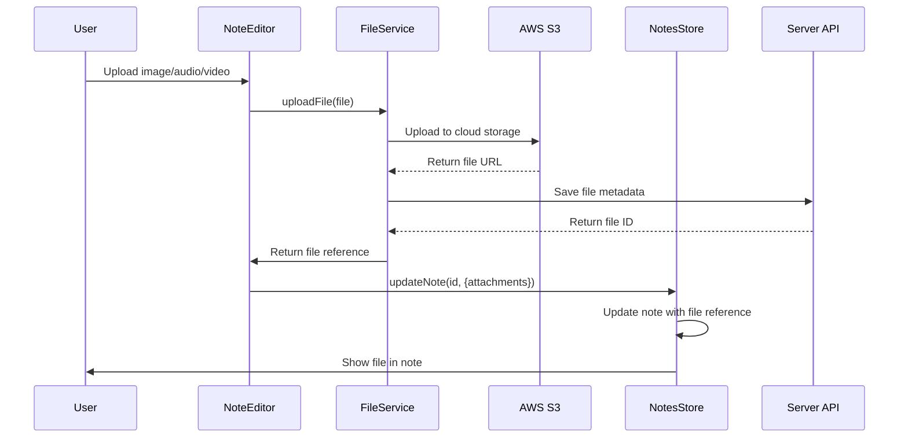

### Real-time Collaboration Flow (Future)
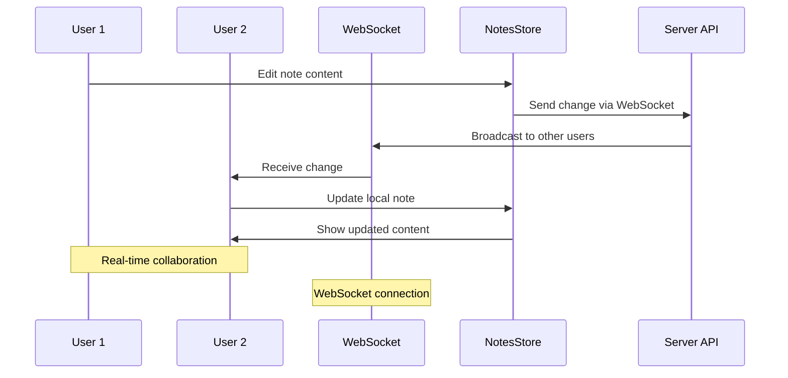

### Error Handling Flow
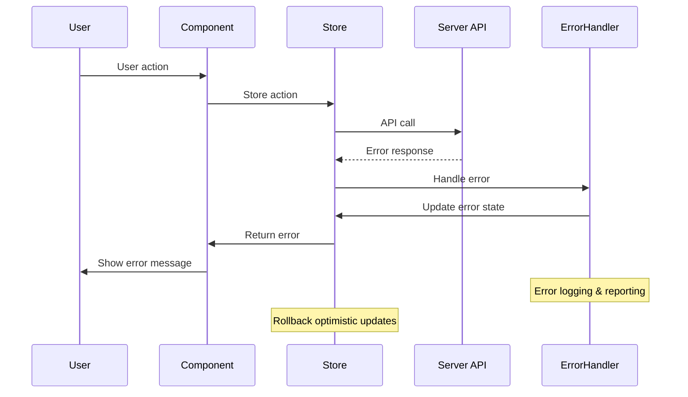

### Data Persistence Layers
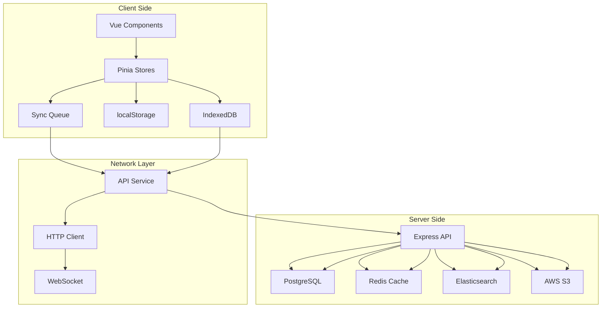

### Component Data Dependencies
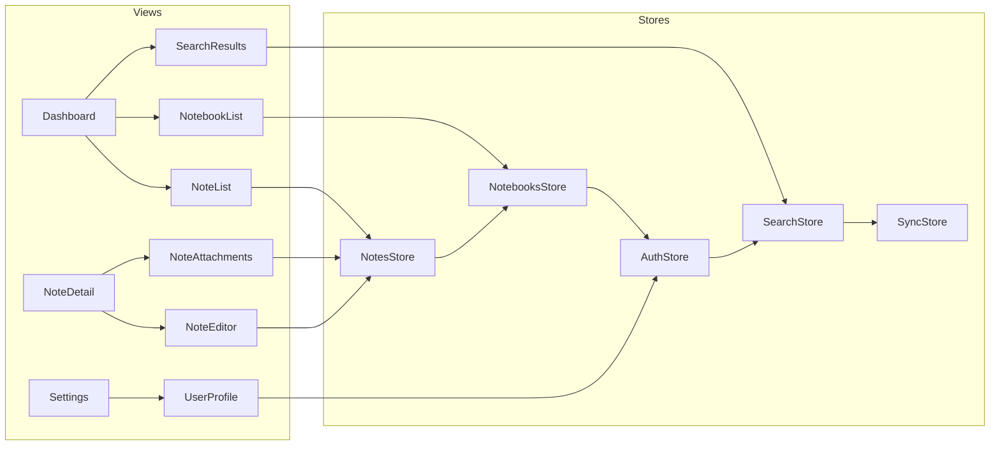

### State Management Hierarchy
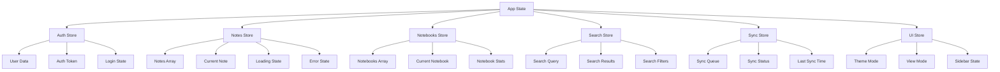

## 🏗️ Store Architecture

### Store Structure
```typescript
// src/stores/notes.ts
export const useNotesStore = defineStore('notes', () => {
  // State
  const notes = ref<Note[]>([])
  const currentNote = ref<Note | null>(null)
  const isLoading = ref(false)
  const error = ref<string | null>(null)
  
  // Getters
  const pinnedNotes = computed(() => 
    notes.value.filter(note => note.pinned)
  )
  
  const notesByNotebook = computed(() => (notebookId: string) =>
    notes.value.filter(note => note.notebookId === notebookId)
  )
  
  // Actions
  const fetchNotes = async () => { /* implementation */ }
  const createNote = async (note: CreateNoteRequest) => { /* implementation */ }
  const updateNote = async (id: string, updates: UpdateNoteRequest) => { /* implementation */ }
  const deleteNote = async (id: string) => { /* implementation */ }
  
  return {
    // State
    notes,
    currentNote,
    isLoading,
    error,
    // Getters
    pinnedNotes,
    notesByNotebook,
    // Actions
    fetchNotes,
    createNote,
    updateNote,
    deleteNote
  }
})
```

### Store Rules

#### ✅ DO:
- **Centralize state**: All shared data lives in stores
- **Pure actions**: Actions only update state, no side effects
- **Async handling**: Use separate async actions for API calls
- **Error boundaries**: Handle errors at the store level
- **Optimistic updates**: Update UI immediately, sync in background

#### ❌ DON'T:
- **Direct API calls**: Components never call APIs directly
- **Local state for shared data**: Don't duplicate store state in components
- **Side effects in actions**: Keep actions pure
- **Bypass stores**: Never access data outside the store pattern

## 📊 Data Flow Patterns

### 1. Note Creation Flow
```
User clicks "New Note" 
→ NoteEditor component calls store.createNote()
→ Store updates notes array
→ NoteList component re-renders with new note
→ Store persists to IndexedDB
→ Store syncs to server in background
```

### 2. Note Editing Flow
```
User edits note content
→ NoteEditor calls store.updateNote(id, content)
→ Store updates note in array
→ All note components re-render
→ Store saves to IndexedDB
→ Store queues for sync
```

### 3. Search Flow
```
User types in search
→ SearchInput calls store.searchNotes(query)
→ Store filters notes array
→ NoteList shows filtered results
→ Store caches search results
```

### 4. Sync Flow
```
Background sync triggered
→ SyncStore checks for pending changes
→ Store sends changes to server
→ Store receives server updates
→ Store merges changes with local data
→ Components re-render with updated data
```

## 🗄️ Data Persistence

### Local Storage Strategy
```typescript
// Store automatically syncs with IndexedDB
const saveToIndexedDB = async (state: NotesState) => {
  const db = await openDB('NotesApp', 1)
  await db.put('notes', state.notes)
  await db.put('notebooks', state.notebooks)
}

const loadFromIndexedDB = async (): Promise<Partial<AppState>> => {
  const db = await openDB('NotesApp', 1)
  const notes = await db.get('notes', 'all')
  const notebooks = await db.get('notebooks', 'all')
  return { notes, notebooks }
}
```

### Data Normalization
```typescript
// Normalized data structure
interface AppState {
  notes: {
    [id: string]: Note
  }
  notebooks: {
    [id: string]: Notebook
  }
  tags: {
    [id: string]: Tag
  }
  ui: {
    currentNoteId: string | null
    currentNotebookId: string | null
    searchQuery: string
    viewMode: 'grid' | 'list'
  }
}
```

## 🔄 Component Data Rules

### Data Consumption
```vue
<!-- ✅ Good: Component consumes store data -->
<template>
  <div>
    <NoteItem 
      v-for="note in notes" 
      :key="note.id" 
      :note="note"
      @update="handleUpdate"
    />
  </div>
</template>

<script setup lang="ts">
import { useNotesStore } from '@/stores/notes'

const notesStore = useNotesStore()
const notes = computed(() => notesStore.notes)

const handleUpdate = (note: Note) => {
  notesStore.updateNote(note.id, note)
}
</script>
```

### Action Dispatching
```vue
<!-- ✅ Good: Component dispatches store actions -->
<template>
  <v-btn @click="createNote">Create Note</v-btn>
</template>

<script setup lang="ts">
import { useNotesStore } from '@/stores/notes'

const notesStore = useNotesStore()

const createNote = async () => {
  await notesStore.createNote({
    title: 'New Note',
    content: '',
    notebookId: 'default'
  })
}
</script>
```

## 🎯 State Management Rules

### Store Organization
- **One store per domain**: `notesStore`, `notebooksStore`, `authStore`
- **Shared state only**: Don't store component-specific state in stores
- **Immutable updates**: Always return new state objects
- **Type safety**: Full TypeScript coverage for all state

### Component State
- **Local state for UI only**: Form inputs, modals, loading spinners
- **Derived state from stores**: Computed values, filtered lists
- **No business logic**: Components only handle presentation

### Data Fetching
- **Store handles all API calls**: Components never fetch data directly
- **Loading states**: Store manages loading/error states
- **Caching**: Store caches data to avoid unnecessary requests
- **Optimistic updates**: Update UI immediately, handle errors gracefully

## 🔄 Side Effects Management

### Async Actions Pattern
```typescript
// Store handles all side effects
const useNotesStore = defineStore('notes', () => {
  const createNote = async (data: CreateNoteRequest) => {
    // Optimistic update
    const tempNote = { ...data, id: generateId(), synced: false }
    notes.value.push(tempNote)
    
    try {
      // API call
      const savedNote = await notesApi.createNote(data)
      
      // Update with server response
      const index = notes.value.findIndex(n => n.id === tempNote.id)
      if (index !== -1) {
        notes.value[index] = { ...savedNote, synced: true }
      }
    } catch (error) {
      // Revert optimistic update
      notes.value = notes.value.filter(n => n.id !== tempNote.id)
      error.value = error.message
    }
  }
})
```

### Error Handling
- **Store-level errors**: Global error state for API failures
- **Component-level errors**: Local error state for UI issues
- **Error boundaries**: Catch and display unexpected errors
- **Retry mechanisms**: Automatic retry for failed requests

## 🔄 Sync Architecture

### Sync Queue Management
```typescript
// src/stores/sync.ts
export const useSyncStore = defineStore('sync', () => {
  const syncQueue = ref<SyncItem[]>([])
  const isSyncing = ref(false)
  const lastSyncTime = ref<Date | null>(null)
  
  const addToSyncQueue = (item: SyncItem) => {
    syncQueue.value.push(item)
    triggerSync()
  }
  
  const processSyncQueue = async () => {
    if (isSyncing.value || syncQueue.value.length === 0) return
    
    isSyncing.value = true
    try {
      const items = [...syncQueue.value]
      syncQueue.value = []
      
      for (const item of items) {
        await processSyncItem(item)
      }
      
      lastSyncTime.value = new Date()
    } catch (error) {
      // Re-add failed items to queue
      syncQueue.value.unshift(...items)
    } finally {
      isSyncing.value = false
    }
  }
})
```

### Conflict Resolution
```typescript
// Conflict resolution strategy
const resolveConflict = (local: Note, remote: Note): Note => {
  // Last-write-wins with timestamp comparison
  if (local.updatedAt > remote.updatedAt) {
    return local
  } else if (remote.updatedAt > local.updatedAt) {
    return remote
  } else {
    // Same timestamp - merge content
    return {
      ...local,
      content: mergeContent(local.content, remote.content)
    }
  }
}
```

## 🔄 Offline-First Architecture

### Offline State Management
```typescript
// src/composables/useOffline.ts
export function useOffline() {
  const isOnline = ref(navigator.onLine)
  const pendingChanges = ref<SyncItem[]>([])
  
  const handleOnline = () => {
    isOnline.value = true
    // Trigger sync when back online
    triggerSync()
  }
  
  const handleOffline = () => {
    isOnline.value = false
    // Queue changes for later sync
  }
  
  onMounted(() => {
    window.addEventListener('online', handleOnline)
    window.addEventListener('offline', handleOffline)
  })
  
  return {
    isOnline,
    pendingChanges
  }
}
```

### Data Synchronization
```typescript
// Background sync with service worker
const syncInBackground = async () => {
  if ('serviceWorker' in navigator && 'sync' in window.ServiceWorkerRegistration.prototype) {
    const registration = await navigator.serviceWorker.ready
    await registration.sync.register('notes-sync')
  }
}
```

## 📋 Data Flow Checklist

### Before Adding New State:
- [ ] Is this data shared across components?
- [ ] Does it need to persist across sessions?
- [ ] Is it derived from other state?
- [ ] Does it require API synchronization?

### Before Adding New Action:
- [ ] Does it update shared state?
- [ ] Is it a pure function (no side effects)?
- [ ] Does it handle errors appropriately?
- [ ] Is it properly typed?

### Before Adding New Component:
- [ ] Does it consume store state correctly?
- [ ] Does it dispatch store actions?
- [ ] Does it handle loading and error states?
- [ ] Is it properly typed?

## 🔄 Integration Points

### API Integration
```typescript
// src/services/api/notes.ts
export const notesApi = {
  async getNotes(): Promise<Note[]> {
    const response = await fetch('/api/notes')
    return response.json()
  },
  
  async createNote(data: CreateNoteRequest): Promise<Note> {
    const response = await fetch('/api/notes', {
      method: 'POST',
      headers: { 'Content-Type': 'application/json' },
      body: JSON.stringify(data)
    })
    return response.json()
  }
}
```

### Local Storage Integration
```typescript
// src/services/storage/indexedDB.ts
export const indexedDBService = {
  async saveNotes(notes: Note[]): Promise<void> {
    const db = await openDB('NotesApp', 1)
    await db.put('notes', notes)
  },
  
  async loadNotes(): Promise<Note[]> {
    const db = await openDB('NotesApp', 1)
    return await db.get('notes', 'all') || []
  }
}
```

---

**Rule**: All data flows through the store. Components never bypass the store pattern. If you need to share data between components, it belongs in a store.
